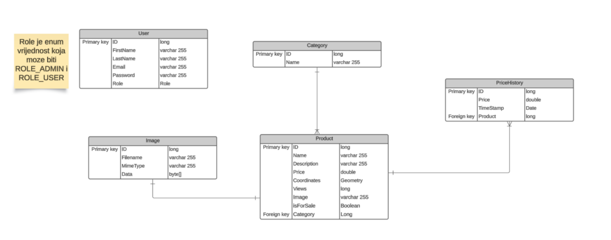

# NearByBackend - backend

This project represents backend code for “Near By” application, an online marketplace with product management system for a company that will allow users to easily find products close by. Implementation is done with Java 17 and Spring Boot, using PostgreSQL for database.

## Project Architecture
Regarding the project architecture, the entire implementation is located in the **src** folder and is organized
into the following folders:
* **config:** contains configuration files (for authorization and authentication)
* **controller:** contains all controllers where APIs are implemented
* **exception:** contains the handler for exceptions (needed for error handling)
* **model:** contains all models/tables needed for the project
* **repository:** contains repositories where DB queries are implemented
* **request:** contains classes for custom requests (for auth – sign in)
* **response:** contains response classes
* **security:** contains all classes needed to configure authorization and authentication
* **seeder:** contains a seeder that populates the database with initial data
* **service:** contains services where API methods are implemented (interface + implementation)

## DB information
ERD diagram:

  

Following this ERD, a database named **near_by_marketplace_db** was created.

DB and models are created through code with the help of the Hibernate ORM tool.

## Possible improvements

Some technical improvements: The app could be refactored, the APIs could have some more complex implementation, the Java version could be updated.

Additionally, Swagger would be a nice addition, because it's good for documenting all the APIs in the application.

